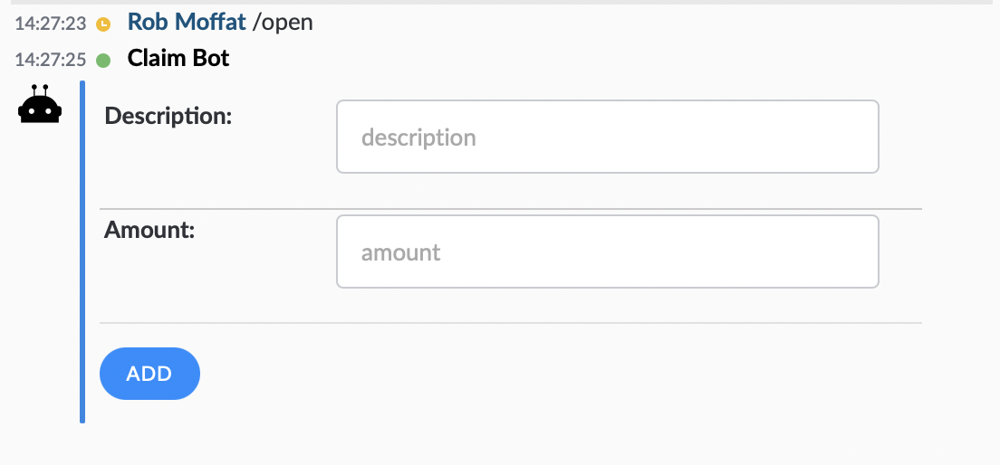
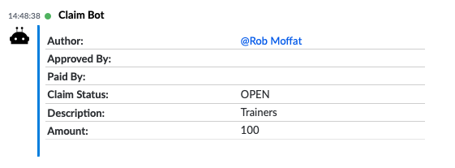

# Getting Started
{: no_toc }

<details open markdown="block">
  <summary>
    Table of contents
  </summary>
  {: .text-delta }
1. TOC
{:toc}
</details>

Spring Bot provides a one-stop-shop for constructing complex, chat-platform-agnostic workflows in Java.  

In this guide, we'll put together a workflow in Java for an expenses claim, and demonstrate how it works. 

## Overview

### What Exactly is a Workflow?

A _workflow_ here is a sequence of interactions carried out by a group of users, coordinated with a bot.  For example, an expenses workflow might look like this:


Note - different people are responsible for different _actions_ in the workflow, that move the state of the workflow on. 

- User A from the Sales Team _raises_ a claim containing some line-item expenses.
- The claim passes to the Approvers Team, where User B can approve it.
- Then, User C in the Accounts Team_ processes_ the claim and transfers A some money.  

### How Can A Chat Platform Help?

Chat Platforms like Symphony, Slack or Microsoft Teams are perfect for workflows like this:

1.  They support messages containing _data_. That means, you can keep track of the status of workflow objects within chats on the platform.  In the example above, the _state_ of the expense claim can be held in a message as JSON.

2.  They support _forms_.  That is, you can present the user a form on screen to be filled, and a button to submit the form.

3.  Teams of people can be put together in _private rooms_.  That is, there could be rooms called "Sales Team Room", "Approvers Team Room" and "Accounts Team Room".  This provides a natural separation of responsibilities:  some actions should only be allowed by the participants of some rooms.

4.  _Bots_ allow us to provide the interface between a workflow (expressed as Java code) on the one hand, and messages on the platform on the other.

## Building Claim Bot

Create a new Spring Boot project and add the dependencies + configuration for your chat platform.

 - For [Symphony](symphony.md#dependencies)

If you want to cheat, you can view the code for this [here](https://github.com/finos/symphony-java-toolkit/tree/master/demos/claim-bot).

### 1.  Creating The `NewClaim` and `OpenedClaim` Beans

We're going to create POJOs to keep track of the claim as it passes through the workflow.  For this we will use two classes:

- `NewClaim`:  contains the amount, and the description of the claim.
- `OpenedClaim`: like a `NewClaim`, but tracks the status of the claim and the details of any approvers.

It's not essential for us to split our claim into two classes like this - we could have used a single class with different _templates_, depending on the state of the claim.  But in this tutorial we're just going to use automatically-generated templates for brevity.

Here is the code for `NewClaim.java`:

```java

@Work
public class NewClaim {

  String description;

  @Min(0)
  Number amount;

  // getters / setters

```

Note the use of `@Min` to validate that the user doesn't enter a negative number in the `amount` field.

Here's the code for `OpenedClaim.java`:

```java

@Work                                                    (1)
public class OpenedClaim  {
  
  enum Status { OPEN, APPROVED, PAID };                  (2)
  
  User author = Action.CURRENT_ACTION.get().getUser();   (3)

  User approvedBy;                                       (4)
  User paidBy;

  @Display(name = "Claim Status")                        (5)
  Status status = Status.OPEN;                           (7)

  String description;

  @Min(0)
  Number amount;

  // getters/setters/                                    (6)
  
```

Notes:

1. The `@Work` annotation tells Spring Bot that we're creating a POJO that will be sent as the payload of chat messages.
2. (&7) Here, we are defining the different states a workflow can be in.  
3. Assign the author as the person interacting with the bot in this request.
4. These fields will track approvals.
5. Here, we are using the `@Display` annotation, which instructs the template generator to call the field `Claim Status` on the screen.
6. You _must_ provide getters and setters for any properties you want Symphony to store/expose.  

Hopefully, all of this will be fairly clear if you are familiar with Java Beans.

### 2.  Allowing Users To Start A Claim

We want the user to be able to type `/open`, and for the bot to reply with a form, allowing them to start the claim process.

For this, we will need to create a Spring `@Controller`, with a method annotated with `@ChatRequest`, like so:

```java

@Controller
public class ClaimController {

  @ChatRequest(value = "open", description="Begin New Expense Claim")
  @ChatResponseBody(workMode = WorkMode.EDIT)
  public NewClaim open(Addressable a) {
    return new NewClaim();
  }
  
```

Note we have also annotated with `@ChatResponseBody` - this tells Spring Bot to return the form in EDIT mode. i.e. a form for editing.

### 3.  Submitting The Form

So far, we have no way for the user to submit this form.  So let's add a button to it.  This goes in `ClaimController.java` too:

```java

  @ChatButton(value = NewClaim.class,  buttonText = "add")
  public OpenedClaim add(NewClaim sc, User u) {
    OpenedClaim c =  new OpenedClaim();
    c.amount = sc.amount;
    c.author = u;
    c.description = sc.description;
    c.status = Status.OPEN;
    return c;
  }
```

Let's see how that works.   When I type `/open`, the Claim Bot responds with a form:



If I get the amount _wrong_, I have to fix the validation error:


But, if the form validates, the a new `OpenedClaim` is returned.  



By default, this goes back into our existing room, but we're going to change that in the next step.

### 4.  Routing

Sending the `OpenedClaim` back to the room that the `NewClaim` was created in wasn't what we wanted.  Really, we wanted this to go to our "Approvers Team" for processing, and some kind of note to be placed in the original room saying "your request has been sent for approval".

But how to represent the Approvers Team?  Here are some options:

 - We could hard-code a list of email addresses in the application, but that would mean when people moved jobs or roles, we'd have to re-release our code.
 - We could have some database somewhere, storing all the roles in it, but this adds another dependency to our application.
 - Instead, we could use the features of the chat platform itself, and have a Private Room for the Approvers Team.  That way, the administrators of the room can keep the membership up-to-date, and all the members of the room will see all of the `OpenedClaim`s when they are created.

In Spring Bot, private rooms are represented with `Chat` objects.   We can create `Response` objects from our `add()` method to send to the `Chat`.  That means reworking our `add()` method like so:

```java

  @Autowired
  Conversations conversations;                                                              (1)
 
  @ChatButton(value = NewClaim.class,  buttonText = "add")                                 
  public List<Response> add(NewClaim sc, User u, Addressable from) {                        (2)
    OpenedClaim c =  new OpenedClaim();
    c.amount = sc.amount;
    c.author = u;
    c.description = sc.description;
    c.status = Status.OPEN;
    
    Chat approvalRoom = conversations.getExistingChat("Claim Approval Room");               (3)
    
    return 
      Arrays.asList(
        new WorkResponse(approvalRoom, c, WorkMode.VIEW),                                   (4)
        new MessageResponse(from,
          Message.of("Your claim has been sent to the Approval Room for processing")));     (5)

  }
```

Notes: 

1.  The `Conversations` bean allows us to look up information about rooms and chats.  We can `@Autowire` this into our controller.
2.  Here, we've added `from`, which tells us the user (or direct chat) that originated the `NewClaim` request.
3.  Here, we look up the `Claim Approval Room`.   Note that if this doesn't exist, a `null` will be returned.
4.  Here, we send our `OpenedClaim`, `c` into the Approval Room we looked up.  When we send around `@Work` beans, we put them in a `WorkResponse`.
5.  Here, we create a `MessageResponse` to tell the person that their claim is going to be processed.

In order for this to work, we have to go and create our room on the chat platform, and add both the `Claim Bot` and the approvers to the room.

### 5. Approve Button

Let's add the `Approve` button to the `OpenedClaim` form, so that people in the `Claim Approval Room` can approve the claim.  Again, this goes into our `ClaimController` class:


```java
  @ChatButton(value=OpenedClaim.class, buttonText = "Approve", rooms={"Claim Approval Room"})(1)
  public OpenedClaim approve(OpenedClaim c, User currentUser) {
    if (c.status == Status.OPEN) {                                                           (2)
      c.approvedBy = currentUser;
      c.status = Status.APPROVED;
      return c;
    } else {
      throw new RuntimeException("Claim should be in OPEN mode");                            (3)
    }
  }
```

Notes:
1.  Here, we are adding a button called `Approve` to the `OpenedClaim` form.   The `rooms` part of the annotation is a check to make sure the button _only appears_ in the `Claim Approval Room`.
2.  This is the happy path - when someone presses the `Approve` button, it sets the `approvedBy` field and changes the status.
3.  This is the bad path - we throw an exception if the `OpenedClaim` is in the wrong state.

Let's see that happening.  Here's our `Claim Approval Room` with the `OpenedClaim` message in it:


Here it is once we've approved it (note the status changes to APPROVED:


And, here's what happens if we hit the "Approve" button again:


### 6. Next Steps
 
Clearly, this shouldn't be the end of the story.  

We'd want the `OpenedClaim` to be passed into the `Accounts Team` room next, so that they could perform their part of the workflow.  

And, it would be nice to keep the user informed of how their workflow is going - notifying them as it moves along with messages back to the original user.

Hopefully in this short tutorial, you can see how you would achieve these steps.

## 7. Asking For Help

The bot _always_ supports the user typing `/help`, which will reveal the commands relevant to the current room (via inspecting the `@ChatRequest` annotation.  e.g.


Depending on the arguments of the command, they may be shows as buttons, or suggestions of what to type.
